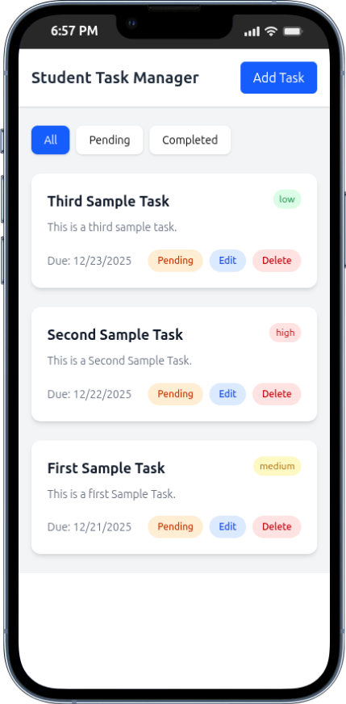
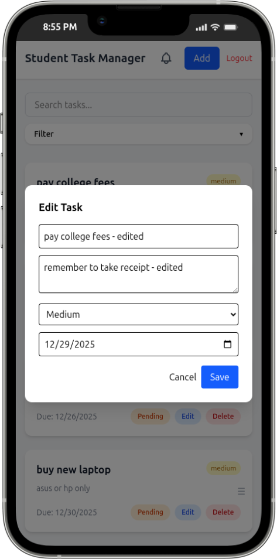
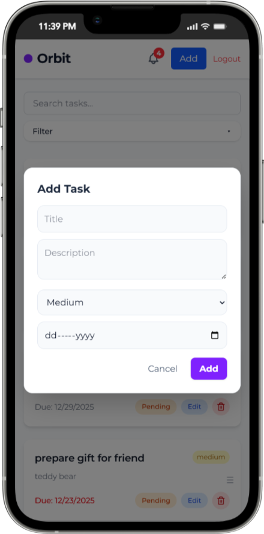

<!-- xamarth -->

<h1 align='center'>📘 Student Task Manager</h1>

<p align='center'><b>A modern, full-stack task management web application with authentication, overdue notifications, drag-and-drop, and a responsive UI. Built with React, Express, and MongoDB, and deployed to production.</b></p>

## 🌐 Live Demo

- **Frontend:** 👉 [task.samarth.site](https://task.samarth.site)
- **Backend API:** 👉 [api.tasks.samarth.site/api/tasks](https://api.tasks.samarth.site/api/tasks)

<br>
<div align='center'>

[](screenshots/empty-state.png)
[](screenshots/task-list.png)
[](screenshots/edit-modal.png)

<!-- [](screenshots/add-task.png) -->
</div>

## ✨ Features

### ✅ Core Functionality

- User authentication (signup/login) with JWT
- Create, edit, delete, and update tasks
- Task properties: title, description, priority (low/medium/high), due date, completion status
- Filter by status (All / Pending / Completed)
- Sort by priority or due date
- Search tasks by title/description
- Mark tasks as complete/pending
- Delete tasks

### 🏆 Advanced Features

- Drag-and-drop task reordering (@dnd-kit)
- Overdue task detection and browser notifications
- Notification panel for overdue tasks
- Auto-refresh overdue tasks (every 5 minutes)
- Responsive design (mobile & desktop)
- Clean empty-state UI
- Visual indicators for overdue tasks
- Modal-based add/edit workflows

## 🛠️ Tech Stack

### Frontend

- React 19 (Vite)
- Tailwind CSS 4
- Axios
- @dnd-kit (drag-and-drop)
- react-hot-toast

### Backend

- Node.js
- Express.js 5
- MongoDB Atlas
- Mongoose 9
- JWT, bcryptjs

### Deployment & Infrastructure

- Frontend: **Vercel**
- Backend: **Render**
- Database: **MongoDB Atlas**
- DNS & Domains: **Cloudflare**

## 📂 Project Structure

```bash
student-task-manager/
│
├── frontend/                       # Frontend (React + Vite)
│   ├── public/
│   ├── src/
│   │   ├── components/
│   │   │   ├── Header.jsx
│   │   │   ├── TaskList.jsx
│   │   │   ├── TaskCard.jsx
│   │   │   ├── FilterDropdown.jsx
│   │   │   ├── AddTaskModal.jsx
│   │   │   ├── EditTaskModal.jsx
│   │   │   └── NotificationPanel.jsx
│   │   ├── pages/
│   │   │   ├── Login.jsx
│   │   │   └── Signup.jsx
│   │   ├── services/
│   │   │   └── api.js              # Axios instance
│   │   ├── App.jsx                 # Root component
│   │   ├── main.jsx                # React entry point
│   │   └── index.css               # Tailwind CSS entry
│   ├── .env                        # Frontend environment variables
│   ├── index.html
│   ├── package.json
│   ├── tailwind.config.js
│   ├── postcss.config.js
│   └── vite.config.js
│
├── backend/                        # Backend (Node + Express)
│   ├── src/
│   │   ├── models/
│   │   │   └── task.js             # Mongoose Task schema
│   │   ├── routes/
│   │   │   └── taskRoutes.js       # Task API routes
│   │   ├── controllers/
│   │   │   └── taskController.js   # Task logic
│   │   ├── config/
│   │   │   └── db.js               # MongoDB connection
│   │   ├── app.js                  # Express app setup
│   │   └── server.js               # Server entry point
│   ├── .env                        # Backend environment variables
│   ├── package.json
│   └── package-lock.json
│
├── .gitignore
├── README.md
└── screenshots/                    # Project screenshots
    ├── empty-state.png
    ├── task-list.png
    └── edit-modal.png
```

## 🗄️ Data Model

### Task Schema

```js
{
  _id: ObjectId,
  title: String,
  description: String,
  priority: "low" | "medium" | "high",
  dueDate: Date,
  completed: Boolean,
  createdAt: Date,
  updatedAt: Date
}
```

## 🔌 API Documentation

**Base URL**

```
https://api.tasks.samarth.site/api
```

| Method | Endpoint   | Description       |
| ------ | ---------- | ----------------- |
| POST   | /tasks     | Create a new task |
| GET    | /tasks     | Get all tasks     |
| GET    | /tasks/:id | Get task by ID    |
| PUT    | /tasks/:id | Update a task     |
| DELETE | /tasks/:id | Delete a task     |

**Query Parameters**

- `?status=pending`
- `?status=completed`

## 📝 Configuration

**Backend** (`.env` required):

```env
PORT=5000
MONGO_URI=<MongoDB connection string>
JWT_SECRET=<secret key>
```

**Frontend** (`.env` required):

```env
VITE_API_URL=<backend API URL>
```

## 🚀 Local Development Setup

### 1️⃣ Clone the repository

```bash
git clone --depth=1 https://github.com/your-username/student-task-manager.git stm
cd stm
```

### 2️⃣ Backend setup

```bash
cd backend
npm install
npm run dev
```

Backend runs at:

```
http://localhost:5000
```

### 3️⃣ Frontend setup

```bash
cd ../frontend
npm install
npm run dev
```

Frontend runs at:

```
http://localhost:5173
```

## 🌍 Deployment Overview

- Frontend deployed on **Vercel** with a custom domain
- Backend deployed on **Render** with MongoDB Atlas
- DNS and HTTPS managed via **Cloudflare**

## 🧪 Testing & Validation

- Manual API testing using Postman
- Browser testing for all CRUD operations
- Responsive testing on mobile & desktop
- ESLint used for code quality and consistency

## 🎓 Assessment & Improvements

This is a **well-structured, production-ready full-stack application** demonstrating:

- Modern web development practices
- Full-stack JavaScript proficiency
- RESTful API design
- User authentication and security
- Responsive UI and UX
- Cloud deployment experience
- Real-world features (notifications, drag-and-drop, filtering)

### Areas for Future Improvement

- Add input validation (e.g., express-validator)
- Centralize error handling in backend
- Add automated tests (backend & frontend)
- Add API documentation (Swagger/OpenAPI)
- Consider TypeScript for type safety
- Add CI/CD configuration

---

<p align="center"><b>Made with ❤️ by xamarth</b></p>
